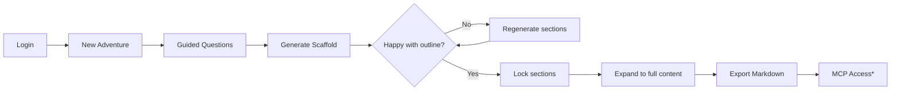

# DaggerGM - AI-Powered Adventure Generator for Daggerheart TTRPG

## 🎯 FEATURE OVERVIEW

Build a full-stack web application that enables Game Masters to **generate, refine, and export Daggerheart adventures** through an AI-guided workflow with structured content stored in Supabase.

### Core Value Proposition

- **For**: Game Masters preparing one-shot adventures (3-4 hours)
- **Problem**: Adventure prep is time-consuming and creatively draining
- **Solution**: AI-guided generation with unlimited refinement cycles
- **Differentiator**: MCP server integration for direct LLM environment access

---

## 🏗️ TECHNICAL ARCHITECTURE

### Stack Requirements

- **Frontend**: React 18+ with Next.js 14+ (App Router)
- **Backend**: Next.js API Routes with tRPC
- **Database**: Supabase (PostgreSQL + pgvector for semantic search)
- **Auth**: Supabase Auth with Row-Level Security (RLS)
- **LLM**: OpenAI GPT-4 (default) with provider abstraction layer
- **Deployment**: Vercel (optimized for Next.js) for frontend; Render for backend
- **Design**: Storybook

### Key Technical Decisions

- **LLM Agnostic**: Factory pattern for swapping providers (admin-only in MVP)
- **Vector Storage**: pgvector for semantic retrieval of rules/content
- **State Management**: Redux/Context
- **Styling**: Tailwind CSS + Radix UI
- **Testing**: Vitest + React Testing Library + Playwright

---

## 🔄 USER JOURNEY & WORKFLOW

### Adventure Generation Pipeline



### Guided Question Flow (Constrained Choices)

| Stage | Question         | Options                                                                                                                   | [SHOULD WE ADD MORE CUSTOMIZATION?]  |
| ----- | ---------------- | ------------------------------------------------------------------------------------------------------------------------- | ------------------------------------ |
| 1     | Adventure Length | • One-shot (MVP)<br>• Multi-session (future)<br>• Campaign (future)                                                       |                                      |
| 2     | Primary Motif    | • High Fantasy<br>• Low Fantasy<br>• Sword & Sorcery<br>• Grimdark<br>• Weird                                             | [MISSING: STEAMPUNK, URBAN FANTASY?] |
| 3     | Secondary Motif  | • None<br>• Cosmic Horror<br>• Political Intrigue<br>• Mystery<br>• Whimsical                                             |                                      |
| 4     | Tone & Hope      | • Tone: Light/Neutral/Tense/Dire<br>• Hope: Bleak/Mixed/Hopeful                                                           | [SHOULD THESE BE SLIDERS INSTEAD?]   |
| 5     | Setting Seed     | • Frontier Town<br>• River Port<br>• Mountain Keep<br>• Forest Shrine                                                     | [NEED MORE OPTIONS? CUSTOM INPUT?]   |
| 6     | Party Details    | • Size: 1-6 players<br>• Level: 1-3 (MVP)<br>• Experience: New/Some/Veteran                                               |                                      |
| 7     | Encounter Mix    | • Preset A: 2 combat, 1 social, 1 explore<br>• Preset B: 1 combat, 2 social, 1 explore<br>• Preset C: 2 combat, 2 explore | [ALLOW CUSTOM MIX?]                  |
| 8     | Difficulty       | • Easy<br>• Standard<br>• Challenging<br>• Deadly                                                                         | [NEED PARTY COMPOSITION INFO?]       |

---

## 🗄️ DATA ARCHITECTURE

### Core Database Schema

```sql
-- Users extended with subscription info
CREATE TABLE user_profiles (
    id UUID REFERENCES auth.users PRIMARY KEY,
    subscription_tier TEXT DEFAULT 'free', -- free, premium
    adventures_created INT DEFAULT 0,
    created_at TIMESTAMPTZ DEFAULT NOW()
);

-- Adventures with state tracking
CREATE TABLE adventures (
    id UUID PRIMARY KEY DEFAULT gen_random_uuid(),
    user_id UUID REFERENCES auth.users NOT NULL,
    title TEXT NOT NULL,
    state TEXT DEFAULT 'draft', -- draft, finalized
    config JSONB NOT NULL, -- stores all guided choices
    movements JSONB[], -- array of movement objects
    created_at TIMESTAMPTZ DEFAULT NOW(),
    updated_at TIMESTAMPTZ DEFAULT NOW(),
    exported_at TIMESTAMPTZ -- tracks when exported
);

-- Vector storage for semantic search
CREATE TABLE game_content (
    id UUID PRIMARY KEY DEFAULT gen_random_uuid(),
    content_type TEXT NOT NULL, -- rule, frame, npc, adversary
    title TEXT NOT NULL,
    content TEXT NOT NULL,
    metadata JSONB,
    embedding vector(1536), -- OpenAI embedding dimension
    created_at TIMESTAMPTZ DEFAULT NOW()
);

-- Enable RLS on all tables
ALTER TABLE adventures ENABLE ROW LEVEL SECURITY;
```

---

## 📝 CONTENT GENERATION STRATEGY

### LLM Integration Approach

1. **Scaffold Generation**
   - Input: JSON config from guided questions
   - Output: 3-5 movement outlines (title + one-line summary)
   - Model: GPT-3.5 for speed [OR ALWAYS GPT-4 FOR QUALITY?]

2. **Movement Expansion**
   - Input: Locked scaffold + movement to expand
   - Context: Relevant rules via vector search
   - Output: Full movement with encounters, NPCs, flavor text
   - Model: GPT-4 for quality

3. **Iterative Refinement**
   - Allow unlimited regeneration at scaffold level
   - Lock/unlock mechanism for user control
   - Maintain context across regenerations

### Prompt Engineering

[SHOULD WE USE CHAIN-OF-THOUGHT PROMPTING?]
[HOW MUCH DAGGERHEART CONTEXT IN EACH PROMPT?]
[TEMPERATURE SETTINGS FOR CREATIVITY VS CONSISTENCY?]

---

## 🎨 UI/UX REQUIREMENTS

### Design System

- **Framework**: [SHADCN/UI OR MATERIAL-UI OR CUSTOM?]
- **Responsive**: Mobile-first design
- **Accessibility**: WCAG 2.1 AA compliance
- **Theme**: Dark mode support [REQUIRED OR OPTIONAL?]

### Key Interfaces

1. **Guided Question Flow**
   - Progress indicator showing current step
   - Back navigation without losing data
   - Auto-save between steps
   - [SHOULD WE ADD TOOLTIPS EXPLAINING EACH OPTION?]

2. **Scaffold Editor**
   - Drag-and-drop reordering [MVP OR FUTURE?]
   - Lock/unlock toggles per movement
   - Regenerate button with confirmation
   - Side-by-side comparison [USEFUL OR OVERKILL?]

3. **Content Expander**
   - Tabbed interface for each movement
   - Real-time Markdown preview
   - Export preview before download
   - [INLINE EDITING OR SEPARATE EDITOR?]

---

## 💰 MONETIZATION & FEATURES

### MVP Feature Set (Free Tier)

- ✅ Unlimited adventure generation
- ✅ Basic guided questions
- ✅ Scaffold + expansion
- ✅ Markdown export
- ❌ MCP server access
- ❌ Custom content library
- ❌ Collaboration features

### Premium Features (Subscription)

- ✅ MCP server integration
- ✅ Advanced customization options
- ✅ Priority processing
- ✅ Export history
- [WHAT ELSE WOULD ADD VALUE?]
- [PRICING TIERS: $5/10/20 PER MONTH?]

### MCP Server Integration

[DETAILED SPEC NEEDED: HOW DOES THE MCP SERVER WORK?]
[WHAT PROTOCOLS/APIS DOES IT EXPOSE?]
[HOW DO USERS AUTHENTICATE THEIR LLM ENVIRONMENT?]

---

## 🔒 SECURITY & COMPLIANCE

### Critical Security Requirements

1. **Row-Level Security**: Users only access their own adventures
2. **API Rate Limiting**: Prevent LLM abuse [LIMITS PER TIER?]
3. **Content Filtering**: Block inappropriate content generation
4. **Data Encryption**: At rest and in transit
5. **GDPR Compliance**: Data export/deletion capabilities

### Authentication Flow

[MAGIC LINKS OR PASSWORD-BASED?]
[SOCIAL AUTH PROVIDERS TO SUPPORT?]
[2FA FOR PREMIUM ACCOUNTS?]

---

## 📊 SUCCESS METRICS

### Technical KPIs

- Page load time < 2 seconds
- LLM response time < 5 seconds (scaffold), < 10 seconds (expansion)
- 99.9% uptime
- < 1% error rate

### User Experience KPIs

- Time to first adventure < 10 minutes
- Scaffold satisfaction rate > 80% (first generation)
- Export completion rate > 90%
- [WHAT OTHER METRICS MATTER TO YOU?]

### Business KPIs

- Free → Premium conversion > 5%
- Monthly active users > 1000 (Month 3)
- User retention > 40% (Month 2)
- [REVENUE TARGETS?]

---

## ❓ CRITICAL DECISIONS NEEDED

### Technical Architecture

1. [GRAPHQL VS REST VS TRPC FOR API?]
2. [WHICH COMPONENT LIBRARY: SHADCN, MUI, MANTINE, CHAKRA?]
3. [STATE MANAGEMENT: ZUSTAND, REDUX, JOTAI, VALTIO?]
4. [DEPLOYMENT: VERCEL, NETLIFY, AWS, RAILWAY?]
5. [MONITORING: SENTRY, DATADOG, NEW RELIC?]

### Product Features

1. [ALLOW CUSTOM ADVENTURE LENGTH IN MVP?]
2. [SUPPORT FOR IMPORTING EXISTING CONTENT?]
3. [COMMUNITY SHARING OF ADVENTURES?]
4. [MULTI-LANGUAGE SUPPORT?]
5. [OFFLINE MODE FOR PREMIUM?]

### Content Strategy

1. [HOW MANY PRE-MADE NPCS/ADVERSARIES?]
2. [CURATED BY WHOM: COMMUNITY, STAFF, AI?]
3. [VERSION CONTROL FOR ADVENTURES?]
4. [CANONICAL VS CREATIVE LICENSE?]

### Business Model

1. [FREEMIUM VS TRIAL-BASED?]
2. [USAGE LIMITS FOR FREE TIER?]
3. [TEAM/ORGANIZATION PLANS?]
4. [WHITE-LABEL OPTIONS?]

---

## 🚀 MVP SCOPE CLARIFICATION

### Included in MVP

✅ User authentication with RLS
✅ Guided question flow (constrained)
✅ Adventure scaffold generation
✅ Lock/revise/regenerate workflow
✅ Full content expansion
✅ Markdown export
✅ Basic subscription management
✅ OpenAI integration (GPT-3.5/4)

### Excluded from MVP (Future)

❌ Multi-session adventures
❌ Campaign-length content
❌ Collaborative editing
❌ Custom NPC/adversary upload
❌ PDF export
❌ Community marketplace
❌ Mobile app
❌ Offline generation

### Edge Cases to Handle

[WHAT IF LLM FAILS MID-GENERATION?]
[HOW TO HANDLE INAPPROPRIATE CONTENT REQUESTS?]
[ADVENTURE SIZE LIMITS?]
[CONCURRENT GENERATION LIMITS?]

---

## 📚 REQUIRED DOCUMENTATION

### From You

1. `daggerheart_ruleset.md` - Complete rules for LLM context
2. Example campaign frames (3-5 for variety)
3. Example NPCs/adversaries with stat blocks
4. MCP server specification/documentation
5. Brand guidelines (if any)

### We'll Create

1. API documentation
2. User guide
3. Integration guide for MCP
4. Admin documentation
5. Deployment guide

---

**Ready to Start?** Please review the [BRACKETED QUESTIONS] throughout this document and provide guidance. Once we have clarity on these decisions, we can generate a comprehensive PRP for implementation.
